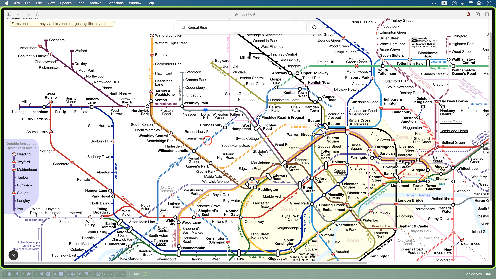
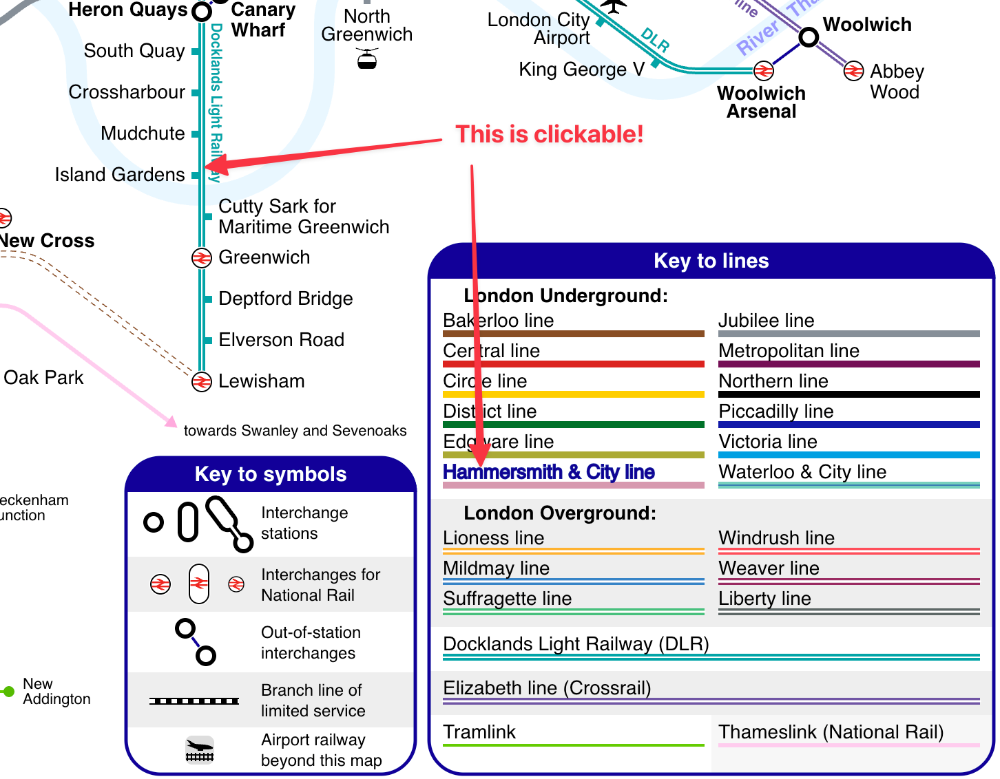

# London Tube Map

An interactive, zoomable vector map of the London Underground, built with Next.js.

Live site: [tube-map.uk](https://tube-map.uk)



## Features

- 🗺️ **Interactive Vector Map**: High-performance SVG map with smooth pan and zoom capabilities (powered by `react-zoom-pan-pinch`).
- 📍 **Nearest Station Locator**: Automatically detects your location and finds the closest Tube station (requires location access)
- 🔍 **Smart Search**: Fuzzy search for stations using `fuse.js`.
- 🔗 **Smart station history**: Your recently selected stations are remembered for quicker access.
- 📱 **PWA Support**: Installable as a Progressive Web App and works offline.
- 🎨 **Modern UI**: Clean, accessible interface built with Shadcn UI and Tailwind CSS.

> **Note**: Nearest station currently relies on the browser’s geolocation API and a network connection.

> **Pro Tip**: The SVG map itself is interactive – you can click stations and lines directly on the map. The legend is also interactive: click a line in the legend to highlight that line on the map.



## How it works

- The map is an SVG, so it stays sharp at any zoom level.
- Zooming and panning are handled by a small React library, so you can move smoothly around the map.
- When you search or select a station, the app scrolls and zooms the map to that station.
- If you choose to share your location, the app only uses it to work out the nearest station. It does **not** store raw coordinates; analytics only receive derived data like the station id and an approximate distance. I am just curious how people use the app)

## Tech stack

- **Framework**: Next.js 16 (App Router)
- **Language**: TypeScript
- **Styling**: Tailwind CSS v4
- **Architecture**: Feature‑Sliced Design
- **Map interactions**: `react-zoom-pan-pinch`
- **Search**: `fuse.js` with some usage‑based ranking
- **Analytics**: PostHog
- **Email / data requests**: Resend
- **PWA / offline shell**: Serwist

## Running locally

1. Install dependencies:

   ```bash
   pnpm install
   ```

2. Start the dev server:

   ```bash
   pnpm dev
   ```

3. Open `http://localhost:3000` in your browser.

### Optional: third‑party services

The app can run without any external keys, but some features are disabled:

- **PostHog** – anonymous usage analytics.
- **Resend** – handling data‑request emails (e.g. “access my data”, “delete my data”).

To enable them:

1. Copy `.env.example` to `.env`.
2. Create projects in PostHog and Resend.
3. Add the relevant API keys and IDs to your `.env`.

## Feedback & support

If you have ideas, spot an issue, or want to ask about how something is implemented, feel free to open an issue or start a discussion in the repository.

If you find the project useful and you’re looking at it on GitHub, a ⭐ on the repo is always appreciated.

## Data sources & licenses

- **Map SVG**: Based on work by [Sameboat](https://commons.wikimedia.org/wiki/User:Sameboat), licensed under [Creative Commons Attribution-ShareAlike 4.0 International](https://creativecommons.org/licenses/by-sa/4.0/).
- **Station coordinates**: Station location data provided by [Transport for London (TfL)](https://tfl.gov.uk) via the [TfL Unified API](https://api.tfl.gov.uk), licensed under the [Open Government Licence v3.0](https://www.nationalarchives.gov.uk/doc/open-government-licence/version/3/).

This is not an official TfL service.
